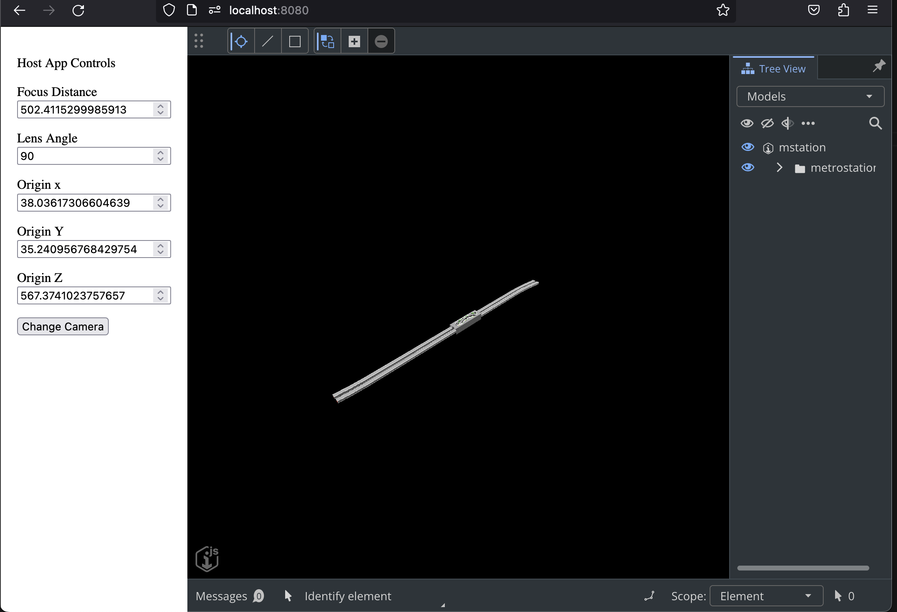

# Embedded iTwin.js Viewer Sample

A very simple example of controlling an iFramed iTwin Viewer from a host website using the browser's [postMessage API](https://developer.mozilla.org/en-US/docs/Web/API/Window/postMessage). This includes modifying the current camera's origin, focusLength, and lensAngle. The focus of the app is on the interactivity between the two windows.

## The app

/src - The iFramed iTwin Viewer app. It's our standard React template with modifications for handling messages from a parent window (the host app) and authenticating from within an iFrame.

/host-app - The host app. It sends messages to the embedded app to interact with the iTwin Viewer. Run on a simple [http-server](https://github.com/http-party/http-server).

## Authentication in an iFrame

Some browsers will not allow authentication within an iFrame due to security. Therefore, you'll need to use our browser auth-client's `signinPopup()` method as opposed to `signIn()`. Be sure to allow popups on your browser for this site or the auth will not succeed.

## Running the demo

1. Clone the repo and `cd` in repo directory
2. Update the values in the .env file as you would with a normal Viewer app.
3. run `npm install`
4. run `npm start` to start the iTwin React Viewer on http://localhost:3000
5. run `npm run start-host` to start the host application on http://localhost:8080 (this can be changed via package.json's `start-host` script. The `-c-1` flag is vital to ensure http-server doesn't cache your files.)
6. Open http://localhost:8080. You should see a website with two panels - one with controls on the left and one with the iTwin Viewer on the right.
7. When ready, the "Change Camera" button will become interactive and the input values will be initialized with current viewport camera properties.
8. Adjust the properties in the input boxes and click "Change Camera" to see the Viewer update.

## About the code

Of particular interest are the `postToViewer` and `listenForMessages` functions in `host-app/index.js`, and the `receiveMessageFromHost` and `sendMessageToHost` functions in `src/App.tsx`

[PostMessage security best practices](https://html.spec.whatwg.org/multipage/web-messaging.html#authors)
